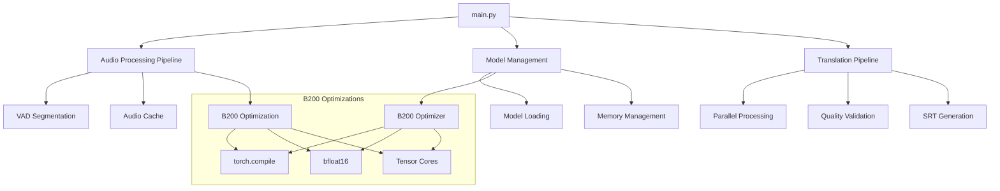

# 🏗️ ARCHITECTURE TECHNIQUE - VOXTRAL B200

## Vue d'ensemble du système



## 🧩 Composants principaux

### 1. **Pipeline Audio (`utils/audio_utils.py`)**
- **Rôle** : Traitement audio optimisé B200
- **Responsabilités** :
  - VAD (Voice Activity Detection) avec Silero
  - Cache audio intelligent
  - Normalisation et resampling optimisé
- **Optimisations B200** :
  - Traitement par batch tensorisé
  - Cache GPU pour audio fréquent
  - Pipeline asynchrone VAD

### 2. **Gestionnaire de modèles (`utils/model_utils.py`)**
- **Rôle** : Chargement et optimisation modèles ML
- **Responsabilités** :
  - Chargement vLLM/Transformers
  - Détection automatique bfloat16 B200
  - OOM recovery avec batch splitting
- **Architecture** :
  ```python
  ModelManager -> ModelState (thread-safe)
  ModelManager -> B200Optimizer (si disponible)
  ModelManager -> OOM Recovery (progressive batch reduction)
  ```

### 3. **Processeur parallèle (`parallel_processor.py`)**
- **Rôle** : Orchestration traitement parallèle B200
- **Architecture modulaire** :
  ```python
  B200OptimizedProcessor
  ├── HardwareConfigurator  # Détection et config hardware
  ├── AudioLoader          # Chargement audio optimisé
  ├── AudioBatcher         # Batching intelligent
  └── B200BatchProcessor   # Traitement batch B200
  ```
- **Pattern async/await** : 28 vCPU + GPU parallélisme

### 4. **Optimiseur B200 (`utils/b200_optimizer.py`)**
- **Rôle** : Optimisations hardware-specific B200
- **Composants** :
  ```python
  B200Optimizer
  ├── optimize_model()      # torch.compile + optimisations
  ├── optimize_tensor()     # dtype + memory format
  ├── create_fused_operation()  # kernel fusion
  └── benchmark_operation() # profiling performance
  ```

### 5. **Validation qualité (`utils/translation_quality.py`)**
- **Rôle** : Validation scientifique traductions
- **Métriques** :
  - Complétude traduction (ratio longueur)
  - Adaptation culturelle (TR → FR)
  - Contraintes sous-titres (vitesse lecture)
  - Score répétition (détection boucles)

## 🔄 Flux de traitement

### Pipeline principal
```
1. Audio Input
   ↓
2. VAD Segmentation (Silero)
   ↓
3. Batch Creation (par durée similaire)
   ↓
4. B200 Optimization (bfloat16 + torch.compile)
   ↓
5. Parallel Processing (vLLM/Transformers)
   ↓
6. Quality Validation
   ↓
7. SRT Generation
```

### Gestion des erreurs
```
OOM Detection
├── Progressive Batch Reduction (16→8→4→1)
├── Memory Cleanup (cache + garbage collection)
└── Fallback CPU (si GPU échec)

Deadlock Prevention
├── AsyncIO + Threading séparation
├── Semaphore limits (GPU concurrent access)
└── Timeout mechanisms
```

## 🚀 Optimisations B200

### 1. **Optimisations mémoire**
- **bfloat16** : Détection auto compute capability ≥8.0
- **Tensor Cores** : Memory format `channels_last`
- **Cache management** : 180GB VRAM optimal usage

### 2. **Optimisations calcul**
- **torch.compile** : `max-autotune` mode
- **Kernel fusion** : Opérations fusionnées automatiques
- **TF32** : Activé pour matmul optimisées

### 3. **Optimisations parallélisme**
- **Batch size adaptatif** : 128 pour B200 vs 32 standard
- **Async processing** : 28 vCPU + GPU overlap
- **Memory-aware batching** : Évite OOM proactif

## 🏛️ Patterns architecturaux

### 1. **Dependency Injection**
```python
# Hardware configuration injectée
class B200OptimizedProcessor:
    def __init__(self):
        self.hardware_config = HardwareConfigurator()
        self.optimizer = get_b200_optimizer() if available
```

### 2. **Strategy Pattern**
```python
# Stratégies de traitement selon hardware
if B200_detected:
    processor = B200BatchProcessor()
else:
    processor = StandardProcessor()
```

### 3. **Observer Pattern**
```python
# Monitoring performance en temps réel
@b200_performance_monitor
def process_batch():
    # Métriques automatiques
```

### 4. **Factory Pattern**
```python
# Création modèles selon backend
def create_model(backend="auto"):
    if vllm_available and prefer_vllm:
        return VLLMModel()
    else:
        return TransformersModel()
```

## 🛡️ Sécurité et robustesse

### 1. **Validation entrées**
- **Sanitisation URLs** : Whitelist domaines autorisés
- **Validation chemins** : Prévention path traversal
- **Validation tensors** : Shapes, dtypes, ranges

### 2. **Gestion erreurs**
- **Circuit breaker** : Arrêt si échecs répétés
- **Graceful degradation** : CPU fallback si GPU indisponible
- **Recovery mechanisms** : OOM, deadlock, corruption

### 3. **Monitoring**
- **Métriques temps réel** : GPU/CPU/Memory usage
- **Alertes** : Seuils performance/memory
- **Logging structuré** : Traçabilité complète

## 📊 Reproductibilité scientifique

### 1. **Determinisme**
```python
# Configuration reproductible globale
def ensure_reproducible_environment(seed=42):
    torch.manual_seed(seed)
    torch.backends.cudnn.deterministic = True
    np.random.seed(seed)
```

### 2. **Validation métamorphique**
- **Tests propriétés** : Invariants mathématiques
- **Edge cases** : Tensors vides, corruption, OOM
- **Integration tests** : Pipeline end-to-end

### 3. **Métriques qualité**
- **Translation quality** : Score composite multi-critères
- **Performance tracking** : Latency, throughput, memory
- **Regression testing** : Comparaison versions

## 🔧 Configuration hardware

### B200 Detection
```python
def detect_b200():
    if torch.cuda.is_available():
        capability = torch.cuda.get_device_capability()
        memory_gb = torch.cuda.get_device_properties(0).total_memory / 1e9
        return capability[0] >= 8 and memory_gb >= 100
    return False
```

### Optimisation adaptative
```python
# Configuration selon hardware détecté
config = {
    "batch_size": 128 if is_b200 else 32,
    "dtype": torch.bfloat16 if capability >= 8 else torch.float16,
    "compile_mode": "max-autotune" if is_b200 else "default"
}
```

## 📈 Métriques de performance

### KPIs principaux
- **Throughput** : segments/seconde
- **Latency** : temps traitement par segment  
- **Memory efficiency** : GPU memory utilization
- **Quality score** : précision traduction composite

### Monitoring temps réel
- **GPU utilization** : % usage, memory allocated
- **CPU utilization** : % usage des 28 vCPU
- **Pipeline stages** : temps par étape
- **Error rates** : taux échec par composant

Cette architecture garantit une scalabilité optimale sur B200 tout en maintenant la robustesse et la reproductibilité scientifique requises.