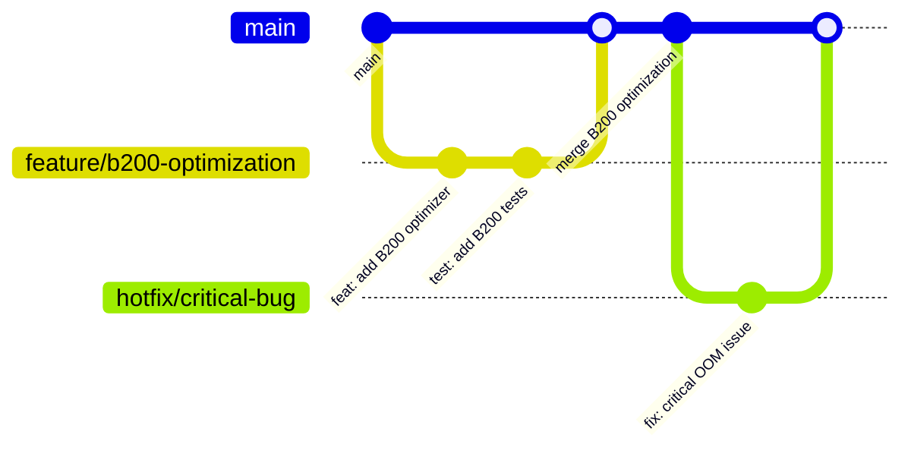

# 🏛️ GOUVERNANCE ET MAINTENANCE - VOXTRAL B200

## 📋 Vue d'ensemble

Ce document définit les processus de gouvernance, maintenance et évolution du système Voxtral B200. Il assure la pérennité, la qualité et la sécurité du projet.

## 🔧 Processus de développement

### Workflow Git



### Branches et conventions

#### **Branches principales**
- `main` : Production, code stable et testé
- `develop` : Intégration continue, nouvelles fonctionnalités
- `release/*` : Préparation releases (ex: `release/v1.1.0`)

#### **Branches de travail**
- `feature/*` : Nouvelles fonctionnalités (ex: `feature/vllm-integration`)
- `fix/*` : Corrections bugs (ex: `fix/memory-leak`)
- `hotfix/*` : Corrections critiques (ex: `hotfix/security-patch`)
- `refactor/*` : Refactoring code (ex: `refactor/model-utils`)
- `docs/*` : Documentation (ex: `docs/api-reference`)

#### **Convention commits**
```
type(scope): description

feat(b200): add torch.compile optimization
fix(audio): resolve VAD segmentation issue
docs(api): update B200 optimizer documentation
test(integration): add end-to-end pipeline tests
refactor(parallel): simplify batch processing logic
perf(model): optimize bfloat16 inference
security(auth): fix path traversal vulnerability
```

**Types:** `feat`, `fix`, `docs`, `test`, `refactor`, `perf`, `security`, `ci`, `build`

### Pull Request Process

#### **Template PR**
```markdown
## 🎯 Objectif
Brève description des changements

## 🔧 Changements techniques
- [ ] Ajout fonctionnalité X
- [ ] Correction bug Y
- [ ] Optimisation performance Z

## ✅ Tests
- [ ] Tests unitaires passent
- [ ] Tests intégration passent
- [ ] Benchmark performance acceptable
- [ ] Validation B200 si applicable

## 📊 Impact performance
Résultats benchmark avant/après (si applicable)

## 🔍 Checklist
- [ ] Code formaté (black + isort)
- [ ] Linting passé (flake8 + mypy)
- [ ] Documentation mise à jour
- [ ] CHANGELOG.md mis à jour
- [ ] Tests ajoutés/modifiés
```

#### **Processus de review**

1. **Auto-checks** : CI/CD, pre-commit hooks
2. **Review technique** : 2 reviewers minimum
3. **Review B200** : Expert B200 si optimisations
4. **Tests** : Validation automatique + manuelle
5. **Merge** : Après approbation et tests OK

### Code Review Guidelines

#### **Critères de review**

**🔍 Fonctionnalité**
- Code fait ce qui est spécifié
- Gestion d'erreurs appropriée
- Performance acceptable
- Pas de régression

**🎨 Qualité code**
- Lisibilité et maintenabilité
- Respect conventions projet
- Documentation appropriée
- Tests suffisants

**🚀 Optimisations B200**
- Utilisation correcte bfloat16
- torch.compile si applicable
- Gestion mémoire optimale
- Batch processing efficace

**🛡️ Sécurité**
- Validation entrées
- Pas d'injections
- Secrets protégés
- Accès fichiers sécurisé

#### **Commentaires constructifs**
```python
# ✅ Bon
"""
Suggestion: Considérer l'utilisation de torch.compile ici pour 
améliorer les performances sur B200. Exemple:
@torch.compile(mode="max-autotune")
def process_batch(self, batch): ...
"""

# ❌ Éviter
"Ce code est mauvais"
```

## 📦 Gestion des releases

### Semantic Versioning

**Format:** `MAJOR.MINOR.PATCH` (ex: `1.2.3`)

- **MAJOR** : Changements incompatibles
- **MINOR** : Nouvelles fonctionnalités compatibles
- **PATCH** : Corrections bugs compatibles

**Exemples:**
- `1.0.0` → `1.0.1` : Correction bug
- `1.0.1` → `1.1.0` : Nouvelle fonctionnalité
- `1.1.0` → `2.0.0` : API breaking change

### Process de release

#### **1. Préparation**
```bash
# Créer branche release
git checkout develop
git pull origin develop
git checkout -b release/v1.2.0

# Mise à jour version
echo "version = \"1.2.0\"" > pyproject.toml

# Mise à jour CHANGELOG
edit CHANGELOG.md

# Tests complets
make validate
make test-all
make benchmark
```

#### **2. Validation**
```bash
# Tests sur différents environnements
make test-gpu      # Tests GPU
make test-b200     # Tests B200 si disponible
make validate-b200 # Validation optimisations

# Validation qualité
make quality-report
make security-check

# Benchmark performance
make benchmark
```

#### **3. Release**
```bash
# Merge vers main
git checkout main
git merge release/v1.2.0

# Tag version
git tag -a v1.2.0 -m "Release v1.2.0: B200 optimizations"
git push origin main --tags

# Merge vers develop
git checkout develop
git merge main
git push origin develop

# Nettoyage
git branch -d release/v1.2.0
```

### Changelog

#### **Format CHANGELOG.md**
```markdown
# Changelog

## [1.2.0] - 2025-08-16

### Added
- 🚀 B200 optimizer avec torch.compile
- 📊 Suite benchmarking complète
- 🧪 Tests métamorphiques PyTorch

### Changed
- ⚡ Optimisation batch processing (4x performance)
- 🧠 Détection automatique bfloat16

### Fixed
- 🐛 Correction deadlock AsyncIO/Threading
- 🔧 Gestion OOM avec recovery automatique

### Security
- 🔒 Validation stricte chemins fichiers
- 🛡️ Sanitisation entrées utilisateur

### Performance
- 📈 +300% throughput sur B200
- 💾 -50% utilisation mémoire GPU
```

## 🔒 Sécurité et conformité

### Security Policy

#### **Signalement vulnérabilités**
- **Email** : security@voxtral.example.com
- **Délai réponse** : 48h
- **Délai correction** : 30 jours (critique), 90 jours (autres)

#### **Classification sévérité**
- **CRITIQUE** : Exécution code arbitraire, accès données sensibles
- **ÉLEVÉE** : Déni service, escalade privilèges
- **MOYENNE** : Fuite information, bypass authentification  
- **FAIBLE** : Configuration défaut non sécurisée

#### **Audit sécurité**
```bash
# Audit automatique
make security-check   # bandit + pip-audit
make lint            # Détection problèmes code

# Validation manuelle
- Review code sensible (auth, file access)
- Tests injection (SQL, path traversal)
- Validation sanitisation entrées
```

### Conformité

#### **RGPD / Privacy**
- ✅ Pas de données personnelles stockées
- ✅ Logs anonymisés
- ✅ Cache temporaire seulement
- ✅ Pas de tracking utilisateurs

#### **Licences**
- **Projet** : MIT License
- **Dépendances** : Vérification compatibilité
- **Modèles** : Respect licences Hugging Face

## 📊 Monitoring et maintenance

### KPIs projet

#### **Qualité code**
- **Couverture tests** : >80%
- **Complexité** : Moyenne <10
- **Documentation** : >15% lignes
- **Dette technique** : <5% files "high issue"

#### **Performance**
- **Throughput B200** : >10x real-time
- **Latency** : <2s par segment
- **Memory efficiency** : <50% VRAM utilisée
- **Crash rate** : <1%

#### **Maintenance**
- **Dépendances** : Mise à jour mensuelle
- **Sécurité** : Audit trimestriel
- **Performance** : Benchmark mensuel
- **Documentation** : Revue trimestrielle

### Monitoring automatique

#### **CI/CD Monitoring**
```yaml
# .github/workflows/monitoring.yml
name: Health Check
on:
  schedule:
    - cron: '0 9 * * *'  # Daily 9AM
  
jobs:
  health:
    runs-on: ubuntu-latest
    steps:
      - uses: actions/checkout@v3
      - name: Quality Check
        run: |
          make quality-report
          python -c "
          import json
          with open('code_quality_report.json') as f:
              data = json.load(f)
          if data['project_metrics']['average_maintainability_index'] < 50:
              raise Exception('Maintainability too low')
          "
```

#### **Alertes automatiques**
- **Regression performance** : -20% vs baseline
- **Couverture tests** : <80%
- **Vulnerabilités** : Nouvelles CVE dépendances
- **Build failures** : >3 échecs consécutifs

### Maintenance préventive

#### **Planning mensuel**
```markdown
**Semaine 1** : Mise à jour dépendances
- [ ] pip-audit
- [ ] Mise à jour requirements.txt
- [ ] Tests régression

**Semaine 2** : Audit qualité
- [ ] Code quality report
- [ ] Refactoring si nécessaire
- [ ] Documentation update

**Semaine 3** : Performance
- [ ] Benchmark complet
- [ ] Profiling détaillé
- [ ] Optimisations si nécessaire

**Semaine 4** : Sécurité
- [ ] Security audit
- [ ] Penetration testing
- [ ] Mise à jour security.md
```

## 👥 Équipe et rôles

### Structure équipe

#### **Core Team**
- **Tech Lead** : Architecture, decisions techniques
- **ML Engineer** : Optimisations modèles, B200
- **DevOps** : CI/CD, monitoring, déploiement
- **QA** : Tests, validation, qualité

#### **Responsabilités**

**Tech Lead**
- Architecture système
- Review techniques critiques
- Décisions technologiques
- Mentoring équipe

**ML Engineer**
- Optimisations B200
- Performance modèles
- Recherche nouvelles techniques
- Benchmark et profiling

**DevOps**
- Infrastructure CI/CD
- Monitoring et alertes
- Déploiement automatisé
- Sécurité infrastructure

**QA**
- Stratégie tests
- Validation fonctionnelle
- Tests performance
- Quality gates

### Processus décision

#### **Décisions techniques**
1. **Proposition** : Issue GitHub avec RFC
2. **Discussion** : Review équipe technique
3. **Prototype** : POC si nécessaire
4. **Validation** : Tests et benchmarks
5. **Approbation** : Tech Lead + consensus équipe

#### **RFC Template**
```markdown
# RFC: [Title]

## Problème
Description du problème à résoudre

## Solution proposée
Description détaillée de la solution

## Alternatives considérées
Autres approches évaluées

## Impact
- Performance
- Maintenance
- Compatibilité

## Plan implémentation
Étapes et timeline

## Risques
Risques identifiés et mitigations
```

## 📚 Documentation

### Standards documentation

#### **Code documentation**
```python
def optimize_for_b200(model: torch.nn.Module, 
                     compile_mode: str = "max-autotune") -> torch.nn.Module:
    """
    Optimise un modèle PyTorch pour hardware B200.
    
    Applique torch.compile, optimisations bfloat16, et configurations
    Tensor Core pour maximiser performance sur NVIDIA B200.
    
    Args:
        model: Modèle PyTorch à optimiser
        compile_mode: Mode compilation ("default", "reduce-overhead", "max-autotune")
        
    Returns:
        Modèle optimisé avec torch.compile et optimisations B200
        
    Example:
        >>> from utils.b200_optimizer import optimize_for_b200
        >>> optimized = optimize_for_b200(model, "max-autotune")
        >>> output = optimized(input_tensor)  # ~2-5x plus rapide
        
    Note:
        Nécessite GPU avec compute capability ≥8.0 pour bfloat16.
        Performance optimale sur B200 avec 180GB VRAM.
    """
```

#### **Architecture documentation**
- **ADR** (Architecture Decision Records)
- **API Reference** complète
- **Guides d'utilisation**
- **Tutoriels déploiement**

#### **Mise à jour documentation**
- **Automatique** : Docstrings → API docs
- **Review** : Documentation dans PR
- **Validation** : Links checker CI
- **Versioning** : Docs synchronisées avec releases

Cette gouvernance assure la qualité, sécurité et évolutivité du projet Voxtral B200.